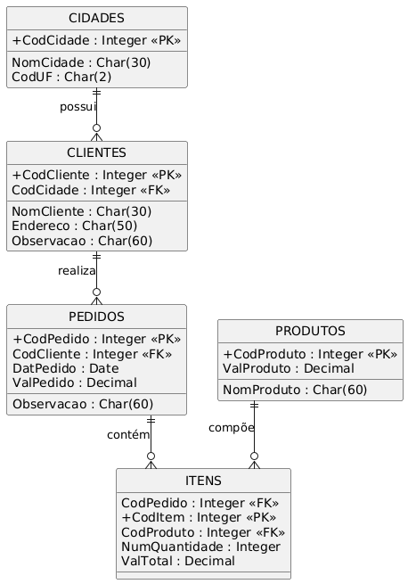

# 🍔 Hamburgueria XTudo

Sistema de controle para uma hamburgueria, desenvolvido em **Progress 4GL**, com foco no gerenciamento de **clientes** e **controle financeiro** dos pedidos.

---

## 📖 Índice

1. [📌 Descrição do Projeto](#1-📌-descrição-do-projeto)  
2. [🧠 Regras de Negócio](#2-🧠-regras-de-negócio)  
3. [⚙️ Instalação e Configuração do Ambiente](#3-⚙️-instalação-e-configuração-do-ambiente)

---

## 1. 📌 Descrição do Projeto

Este projeto tem como objetivo centralizar o gerenciamento de uma hamburgueria através de um sistema com as seguintes funcionalidades:

- Cadastro e validação de **cidades**;
- Gerenciamento completo de **clientes**, com validação cruzada com cidades e pedidos;
- Cadastro de **produtos** vendidos;
- Gerenciamento de **pedidos** e seus respectivos **itens**, com controle de integridade entre clientes e produtos;
- Sistema de **menu principal** com navegação entre os cadastros;
- Validação e bloqueio de exclusões para evitar perda de integridade nos relacionamentos.

### 🗂️ Modelo de Dados

Abaixo está a organização e o diagrama entidade-relacionamento que representa o modelo de dados utilizado no sistema:

## 📋 Estrutura das Tabelas

### 🏙️ Tabela: Cidades
| Campo       | Tipo de Dado | Flags | Formato   |
|-------------|--------------|-------|-----------|
| CodCidade   | integer      | im    | `>>>>9`   |
| NomCidade   | character    | m     | `x(30)`   |
| CodUF       | character    | m     | `x(2)`    |

### 👥 Tabela: Clientes
| Campo       | Tipo de Dado | Flags | Formato   |
|-------------|--------------|-------|-----------|
| CodCliente  | integer      | im    | `>>>>9`   |
| Endereco    | character    |       | `x(50)`   |
| CodCidade   | integer      | im    | `>>>>9`   |
| Observacao  | character    |       | `x(60)`   |
| NomCliente  | character    | m     | `x(30)`   |

### 📦 Tabela: Itens
| Campo         | Tipo de Dado | Flags | Formato        |
|---------------|--------------|-------|----------------|
| CodPedido     | integer      | im    | `>>>>9`        |
| CodItem       | integer      | im    | `>>>>9`        |
| CodProduto    | integer      | im    | `>>>>9`        |
| NumQuantidade | integer      | m     | `>>>>9`        |
| ValTotal      | decimal(2)   | m     | `>>>>>>>9.99`  |

### 🧾 Tabela: Pedidos
| Campo       | Tipo de Dado | Flags | Formato        |
|-------------|--------------|-------|----------------|
| CodPedido   | integer      | im    | `>>>>9`        |
| CodCliente  | integer      | im    | `>>>>9`        |
| DatPedido   | date         | m     | `99/99/9999`   |
| ValPedido   | decimal(2)   | m     | `>>>>>>>9.99`  |
| Observacao  | character    |       | `x(60)`        |

### 🍔 Tabela: Produtos
| Campo       | Tipo de Dado | Flags | Formato        |
|-------------|--------------|-------|----------------|
| CodProduto  | integer      | im    | `>>>>9`   |
| NomProduto  | character    | m     | `x(60)`        |
| ValProduto  | decimal(2)   | m     | `>>>>>>>9.99`  |

### Diagrama Entidade-Relacionamento

**Descrição do Modelo**:
- A tabela `CIDADES` possui cidades que podem ter vários `CLIENTES`.
- Cada `CLIENTE` realiza `PEDIDOS`, que são compostos por `ITENS`.
- Os `ITENS` fazem referência aos `PRODUTOS`.
- O relacionamento entre as tabelas mantém a integridade dos dados e reflete a lógica de negócio da hamburgueria.

---

### 1.2 Estrutura das Pastas

O projeto está organizado de forma modular, contendo as seguintes pastas na raiz do diretório `XTudo---Progress/`:

- **`treinamento/`**: Contém códigos e exemplos para aprendizado e prática com a linguagem Progress 4GL.
- **`Xtudo-Progress/`**: Contém o sistema principal da Hamburgueria XTudo.

### Detalhamento dos Diretórios

#### **treinamento/**

Esta pasta é dedicada ao aprendizado e à prática com a linguagem Progress 4GL. Ela serve como um ambiente de testes e exemplos.

- **Conteúdo:** Inclui procedimentos e programas simples criados para explorar conceitos como:
  - Manipulação de banco de dados (CRUD).
  - Navegação de registros.
  - Exportação de dados.

- **Propósito:** Funciona como uma base para testar funcionalidades e técnicas antes de implementá-las no sistema principal.  
  É uma fonte de consulta para trechos de código que podem ser reutilizados.

---

#### **Xtudo-Progress/**

Esta pasta contém o sistema principal da Hamburgueria XTudo. É aqui que o software de fato reside.

- **Conteúdo:** Inclui os arquivos `.p` (procedures) que gerenciam as principais funcionalidades do sistema:
  - Cadastro de cidades, clientes e produtos.
  - Gerenciamento de pedidos e itens.

- **Regras de Negócio:** Diversas regras de negócio estão implementadas diretamente neste código, incluindo:
  - Geração automática de códigos sequenciais.
  - Bloqueio de exclusão de registros com dependências.
  - Atualização automática de valores totais de pedidos.
  - Exportação de dados para os formatos CSV e JSON.

- **Fluxo do Sistema:** Esta pasta define o fluxo completo de navegação entre as telas e a integração de todas as funcionalidades do projeto.

## 2. 🧠 Regras de Negócio

### 2.1 📍 Cadastro de Cidades
- Código da cidade gerado automaticamente por sequência;
- O código só pode ser definido na inclusão;
- Não permite excluir uma cidade vinculada a algum cliente;
- Mensagem de erro caso haja tentativa de exclusão com vínculo.

### 2.2 👥 Cadastro de Clientes
- Código do cliente gerado automaticamente por sequência;
- Validação da cidade informada (precisa ser válida e existente);
- O código só pode ser definido na inclusão;
- Não permite excluir cliente com pedidos vinculados.

### 2.3 🍟 Cadastro de Produtos
- Código do produto gerado automaticamente por sequência;
- O código só pode ser definido na inclusão;
- Não permite excluir produtos usados em pedidos.

### 2.4 🧾 Cadastro de Pedidos e Itens
- Código do pedido gerado automaticamente por sequência;
- Validação de cliente ao criar/alterar pedido;
- Validação de produto ao incluir/alterar item;
- Exclusão em **cascata**: ao excluir um pedido, todos os itens vinculados são excluídos automaticamente.

---

## 3. ⚙️ Instalação e Configuração do Ambiente

Este sistema foi desenvolvido em **Progress OpenEdge 12.8 (64 bits)** e exige a configuração adequada para codificação e testes locais.

### 3.1 ✅ Pré-requisitos (nesse caso)

- **Java JDK 20.0.2**
- **Progress OpenEdge 12.8 for Classroom Edition**
- Sistema operacional: **Windows 64 bits**

### 3.2 ☕ Instalação do Java

1. Acesse: [https://jdk.java.net/archive/](https://jdk.java.net/archive/)
2. Baixe e extraia o **Java JDK 20.0.2** para `C:\java\jdk-20`
3. Vá em **Propriedades do Sistema > Variáveis de Ambiente**
4. Em **Variáveis do Sistema**, adicione:
   - `JAVA_HOME` com o valor `C:\java\jdk-20`
   - Edite a variável `PATH` e adicione ao final: ` %JAVA_HOME%\bin `

### 3.3 📦 Instalação do Progress OpenEdge

1. Acesse: [https://www.progress.com/oedk](https://www.progress.com/oedk)
2. Na seção `CLASSROOM`, clique em `GET STARTED`
3. Crie uma conta ou faça login
4. Faça o download do arquivo: `PROGRESS_OE_12.8_WIN_64_PDSOE.zip`
5. Extraia e execute `setup.exe`
6. Siga as etapas:
   - Clique em **Next**
   - Aceite os termos
   - Clique em **Install**
   - Finalize com **Finish**

### 3.4 🚀 Testando o Ambiente

Após a instalação:

- No menu iniciar, execute:
  - `Progress > GUI Procedure Editor 12.8 (64 Bits)`
- Você verá o ambiente de desenvolvimento pronto para compilar e testar os arquivos `.p` do projeto.

### 3.5 🛠️ Próximos Passos — Usando o Banco e Arquivos Disponibilizados

### 3.5.4 💾 Restaurando Banco de Dados Limpo

1.  Feche o banco no Procedure Editor.
2.  Apague os arquivos da pasta `C:\treinamento\bd`.
3.  Copie os arquivos de `C:\treinamento\bd\backup` para `C:\treinamento\bd`.
4.  Reconecte o banco e rode novamente.
